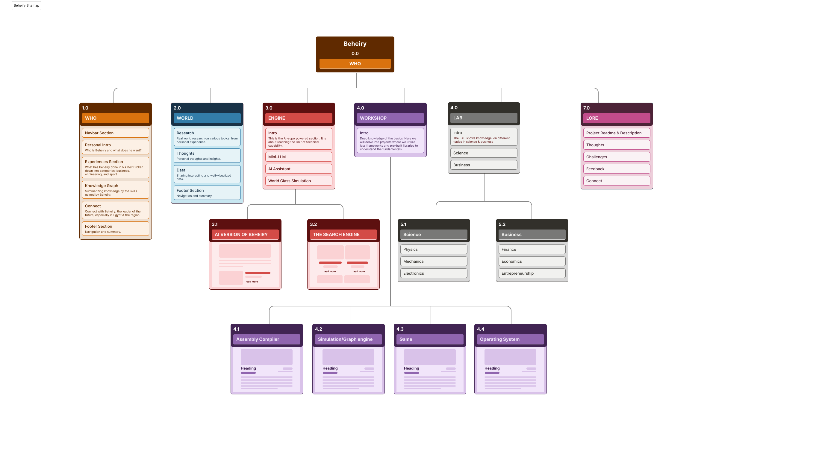

# Beheiry
A testament of skill, and a training ground.

## Purpose of the Project
As a computer engineer, I've noticed that there are so many paths I could take: there's AI, there's Software Engineering, there's Embedded Systems, there's Algorithm Analysis, there's Data Engineering, there's Chip Design, and there are many more. I've personally chose a few paths to focus on because I see potential with them and they align with my long-term plans. 
Critical to achieving anything, however, is mastering Software Engineering. I do not plan to be the best, nor to know every framework, but I plan to have a fundamental understanding of software engineering concepts, from the very beginning to the very end. The purpose of this project is to achieve this understanding.

## Project Sitemap

## Task List
- [ ] Create a template engine (just like Django, because something like a navbar is used time and again)
- [ ] Create components for use and re-use, and then create some place where you can easily add them. Specifically, do that for:
  - [x] Experiences section in WHO page --> needs standardization and design which is not based on random gaps and sizes but relative ones
  - [ ] Knowledge Graph in WHO page  --> complex but you can implement a basic version with easily add-able nodes
  - [x] Standardize the colors used throughout by defining them in a safe place and re-using them.
  - [ ] Make sure that the overall visual hiearchy is ok.
  - [ ] Implement the backbone of the whole website just like you did with home page.
  - [ ] Create a standard footer (which may or may not be used on all pages).
  - [x] Check why resources (images fonts etc) do not show on vercel hosting.
- [ ] Next: hunt down the good look. Interactivity, overall look, something interesting.
  - [x] Add to the navbar the logo on the left, which is also clickable.
  - [x] Make the main menu in the middle.
  - [ ] Introduce interactivity so that when someone makes the screen smaller it doesn't break.
  - [ ] Make the initial page always a very high quality photo that's interesting.
  - [ ] make the navbar consistent with scrolling
  - [ ] Make the text bigger. Every part of the page should be big enough. Give the viewer the full experience!
  - [ ] Within the home page, there should be introductions to all the other pages. Now that I think about it, every page should have its own style and life. This will make your project more interesting anyway
  - [ ] Everything should have animations as they appear, including photos, text, and videos. Nothing should just appear. 
  - [ ] Make good use of margins and gaps, and make them consistent.
  - [ ] Enrich your webpage with photos and videos.
- [ ] Establish a naming-convention and add it to the Readme and follow it throughout. Think it thoroughly. Establish rules for html and css hierarchies insted of randomness.

## Log
### 28/8/2026
Earlier this week I've had the idea of this project and planend the basics, including the sitemap. I've started delving into javascript & typescript because I did not know anything about them. Created the github repo and created a Vercel account, which I've connected with the project. Started this *log*, which aims to be a short description of work done when it's done. Reflects not only consistency but learning. 

Note: Figma is a whole world by itself! I just searched up "sitemap template" and found a Figma one and changed the elements inside of it. Otherwise it would've taken my a whole lot of time just to get the rectangles in place! This is the [template](https://www.figma.com/community/file/1357281387241619479/information-architecture-sitemap-builder-for-figma) I used. 

### 31/8/2026
Haven't logged on in a while because I was very busy with other things. Today, I've started working again on the backbone. I will initiate a to-do list of cool ideas which need implementing and will keep it in a section named "Task List" here in this readme.
Wow. Even the simples styling and organization of a page take a lot of time.

### 1/9/2026
Played a little with CSS today. I understand now why they make so many nested *divs*: because it makes your life much easier, and you have much more control. The *span* is basically equivalent to div. Most important thing I learned today (till now at least) is that the *display:flex* is the most powerful because you can control so much. It is much better than block or inline or other alternatives. 
Also, not because you know CSS you know how to design. It is like saying you can paint because you have the colors and the brush :))  

Visual design for brand or logo can change how it's perceived therefore it's very important. Key is: know what message you want to convey, then base your visual layout on it. I want the main page and content to look professional and top-notch, that's why I chose the browny colors. The high-tech is just black and golden with cool font because, well, its supposed to be high-tech.

## 2/9/2026
Did alot of playing with CSS today. Figured out why poeple need structure and why somehting like Tailwind is really powerful. Re-iterating that knowing CSS is different from knowing how to style and make visually appealing websites. Installed fonts for the first time ever today and added some content to main page. Implementing the knowledge graph will not be simple. Getting the overall style to become good will also need some work. Putting the right icons in the right places and creating re-usable designs is critical.  
Of course, I need to code and move faster than this. But every time I work on this project I learn alot. 

## 4/9/2026
You either know style or you don't. If you don't, experiment until you reach something that is not bad, and stick with the simple. You can never go wrong with the simple, with the complex you can either go very right or very wrong.